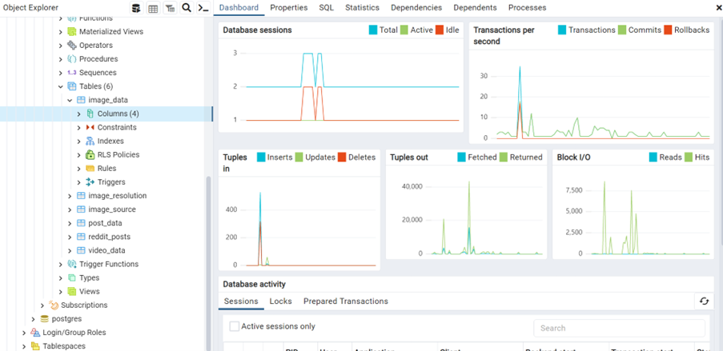

# Python JSON Parsing and PostgreSQL Integration

The purpose of this project is to develop an understanding of JSON file formats and how unstructured text data can be stored in a PostgreSQL database, and used in Python. 

Please see `https://github.com/Daniel-Elston/JSON_to_PGSQL/blob/master/Notebooks/B1_JSON_Exploration/json_exploration_3.ipynb` for JSON parsing code.

#### -- Project Status: [Complete]

## Project Objective

Textual data is often unstructured and can be extremely messy. Having the ability to appropriately store this form of data is essential for ML model building and generating insights.

The first stage of this project will raw unstructured data in .JSON format will be parsed using Python then stored in a PostgreSQL database. Once the data has been stored in an organised manner, PostgreSQL queries will used to export data ready for processing in Python.

## Raw Data

https://www.reddit.com/r/all.json

## Technologies

* Python (JSON data handling)
* PostGreSQL
* Libraries: Pandas, NumPy

## Methodologies

* Parsing and handling JSON data
- Database design and management with PostgreSQL
- Data processing and analysis using Python libraries (Pandas, NumPy)

## Contributing Members

**Team Lead: [Daniel Elston](https://github.com/Daniel-Elston)**

|Name     |  GitHub Handles   |  
|---------|-----------------|
| Daniel Elston | [GitHub D. Elston](https://github.com/Daniel-Elston)   |

Please feel free to contact me if you have any questions, require any further information or wish to contribute.
 
Email: delstonds@outlook.com  
